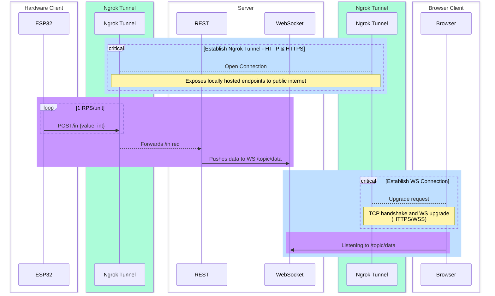

# [JDSG2023] diylogger

## Project Description

Fullstack real-time sensor data visualisation and analytics project.

## Project MVP1.0 Completed

1 sensor pushing live data to a dynamically updated line chart on browser via public internet-accessible endpoint.


## Tech Stack v1.0

- **Hardware**: Arduino ESP32 (+WiFi +Photoresistor +Fixed resistor)
- **Infra**: Ngrok (Http/Https Tunnel)
- **Backend**: Java Spring Boot (Rest Controller & WebSocket - Sock/Stomp)
- **Frontend**: HTML/JS (ChartJS & WebSocket - Sock/Stomp)

## Diagram



## Process Notes aka rabbit holes [22Aug23 > 2Oct23]

- **[1]** ESP32's known WiFi/ADC read issues: hardware read 0s only after connecting to WiFi
  - Readings were taken from GPIO15
  - Found solution on [StackExchange](https://arduino.stackexchange.com/questions/84888/analog-read-not-working-while-using-wifi)
  - Switched to GPIO36


```
That means you can't use the ADC on any of the ADC2 channels while WiFi is on: GPIO4, GPIO0, GPIO2, GPIO15, GPIO13, GPIO12, GPIO14, GPIO27, GPIO25 and GPIO26.

But you can use ADC1, which uses pins GPIO36, GPIO37, GPIO38, GPIO39, GPIO32, GPIO33,GPIO34 and GPIO35.
```

- **[2]** Ngrok-related challenges
  <br/> A few ways to do this. Arduino & SB server can share a local network via Ethernet/ router - opted out bc don't have spare hardware. Or they can talk over the Internet. Ngrok seemed an obvious choice due to avoid enlisting managed services.

      - 1 tunnel only on free plan & no TLS customisation
          - Want HTTPS to avoid dealing with CORS on browser
          - Want HTTP to avoid dealing with TLS auth/certificates on Arduino
      - Bit the bullet and got onto Ngrok premium for learning purpose
          - TLS is just hard to set up - working network knowledge is very minimal
          - Ngrok defaults to automatic TLS, the CA, cert & key are not disclosed
      - **Solution:** Explicitly configure tunnel with 2 schemes (HTTP & HTTPS)
          - Both clients are happy
          - But this is not a secure/good end-game solution

- **[3]** REST+WS vs WS only server
  <br/> First time working with WS. SockJS library & STOMP protocol are recommended parts of WS loadout as they bring browser compatability/ convenient WS management.

      - Initial attempt: hardware directly pushes data to /topic/data
          - WS could not connect at all, no error msg produced. (Hindsight: likely TLS issue)
          - No STOMP WS libraries for ESP32 - I'm not sure if data needs to be packaged in a certain way on chip for browser's STOMP client to accept it
      - **Good enough solution:** ESP32 can loop HTTP calls to a rest endpoint, there are reliable REST -> WS messaging Java libraries
          - WS is low-latency, duplex & stateful - exceed current hardware/server layer needs, not worth the trouble to implement (other typical IoT protocols like MQTT/CoAP are also a bit niche)
          - HTTP is easy and there are options for security (e.g. basic auth) - overhead of establishing TCP connection with each request mitigated by low req frequency
          - UDP is another possible option but there are potential networking issues

## Next Steps

- Incorporate more hardware into the system - visualise data from multiple sources
  - Goal is to have at least 2 boards sending data
- Data aggregation, manipulation and analysis - produce meaningful information from data
  - 2-data source running mean line
  - Chart substantive information (e.g. lumens) rather than ADC units
- Contrived scale to learn more about data engineering
  - Mock sensor network of 100 units with Jmeter
  - Implement Kafka with Kstreams to clea/manipulate, store and emit data
  - Add features on frontend that allow more data exploration (e.g. generate historical charts/ calculate standard deviations/ create novel charts by bundling unique subsets of data sources)
